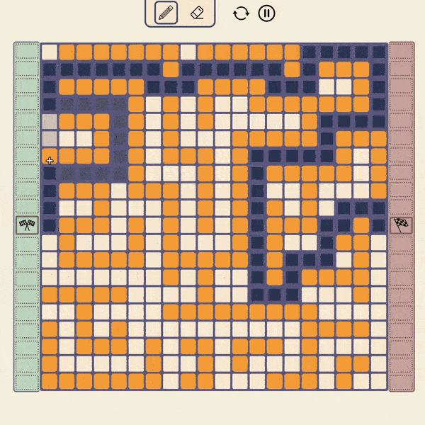

# Maze Builder & Solver




Provides a simple canvas to build custom mazes on a grid. Grid is then solved in realtime using A* search algorithm

## Setup

Install the dependencies:

```bash
# yarn
yarn install

# npm
npm install

# pnpm
pnpm install --shamefully-hoist
```

## Development Server

Start the development server on http://localhost:3000

```bash
npm run dev
```

